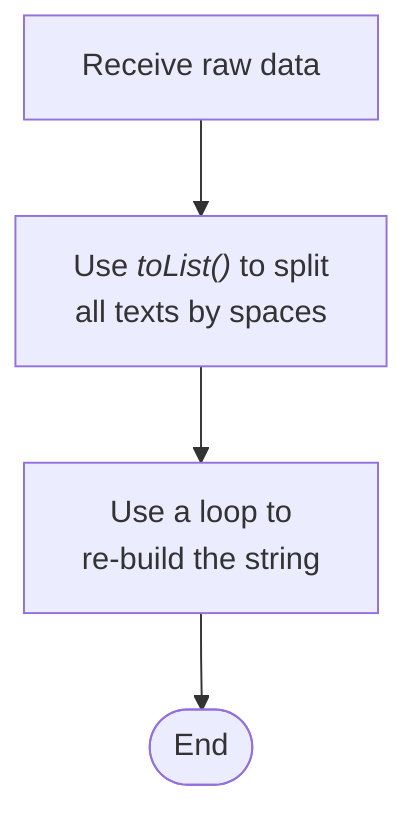

## Problem Statement

If you are used to using `TRIM()` in other programming languages, such as Microsoft Excel or Google Sheets, you will realise that `TRIM()` in deluge only trims off the leading, or trailing spaces given any texts.

But if there are multiple spaces in between of a text string, there aren’t any functions to use in removing the extra spaces.

The idea is to perform the following:

```jsx
// Input
"My    favourite     eyeglasses"
// Output
"My favourite eyeglasses"
```

There are a few ways to do this, but in order to process the different scenarios that may occur within a text string, we’ll be utilising a loop to rebuild the text string. Below is a high level view of how this can be achieved:



---

## Business Use Case

Let’s assume we have a list of texts we have imported into CRM, and like most files with data in them, this might not be as clean as we like. We have a text field that has:

- `My Little    Pony`
- `My     favourite   eyeglasses`
- `My    favourite NBA    player`

And ideally, we’d like all of the white spaces *in between* of the texts to magically disappear 🪄.

---

## Solution

Let’s build a List datatype and capture three scenarios mentioned above.

```jsx
textsToTrim = list();
textsToTrim.add("My Little    Pony");
textsToTrim.add("My     favourite   eyeglasses");
textsToTrim.add("My    favourite NBA    player");
```

Iterate through each element in `textsToTrim`:

```jsx
for each item in textsToTrim{
	// ...
}
```

For each element retrieved in `textsToTrim`, we will be using a space character as a delimiter, and splitting these into elements within another list in a nested loop:

```jsx
for each item in textsToTrim{
	// ...
	for each text in item.toList(" "){
		// ...
	}
}
```

When these loops are written, then we can do whatever we want with it. What we’ll be doing is to introduce a new variable, called `validText` to capture elements in `item.toList(" ")`, which is not a blank.

```jsx
for each item in textsToTrim{
	validText = "";
	for each text in item.toList(" "){
	if (text != ""){
		validText = validText + text + " ";
		}
	}
	//To trim final space in the text
	validText = validText.trim();
	info validText;
}
```

Printing `validText` after the loop executes, you should get the results of:

- `My Little Pony`
- `My favourite eyeglasses`
- `My favourite NBA player`

And you’re done, you data cleaning wizard you! 🎉🧙